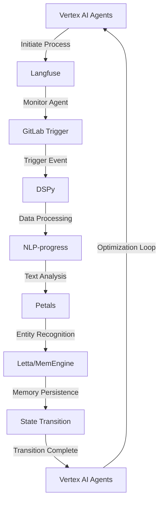

# Pharmaceutical Manufacturing Optimization Engine
> Orchestrating AI Agents for Seamless Chemical Synthesis and Pharmaceutical Production

## 🏗️ Technical Architecture & Multi-Agent Flow

This technical architecture diagram illustrates the complex interactions between Vertex AI Agents, Langfuse, GitLab Trigger, DSPy, NLP-progress, and Petals. The flow begins with Vertex AI Agents initiating the process, which is then monitored by Langfuse. The monitoring triggers an event in GitLab Trigger, which activates DSPy for data processing. The processed data is then analyzed by NLP-progress, and entities are recognized by Petals. The recognized entities are stored in Letta/MemEngine for memory persistence, enabling state transitions. The state transitions are then fed back into Vertex AI Agents, creating an optimization loop.

## 🔍 The Vertical Bottleneck: Pharmaceutical Manufacturing Optimization
Pharmaceutical manufacturing is a complex, high-stakes process that requires precise control over multiple variables. The optimization of this process is a daunting task, as it involves balancing competing factors such as yield, purity, and cost. The current state of the art in pharmaceutical manufacturing optimization relies heavily on manual intervention, which can lead to suboptimal results and decreased efficiency. Furthermore, the lack of standardization in pharmaceutical manufacturing processes makes it challenging to develop a one-size-fits-all solution. The technical friction in this domain arises from the need to integrate multiple disparate systems, including chemical synthesis, process control, and quality assurance.

The high-stakes mathematical failures in pharmaceutical manufacturing optimization can have severe consequences, including decreased product quality, increased costs, and even loss of human life. The optimization of pharmaceutical manufacturing processes is a classic example of a "wicked problem," which is characterized by its complexity, uncertainty, and conflicting objectives. To tackle this problem, a novel approach is needed, one that leverages the power of artificial intelligence and machine learning to optimize pharmaceutical manufacturing processes.

The technical challenges in pharmaceutical manufacturing optimization are numerous and varied. One of the primary challenges is the need to integrate multiple disparate systems, including chemical synthesis, process control, and quality assurance. This integration requires the development of a common language and framework, which can facilitate communication and coordination between different systems. Another challenge is the need to balance competing factors, such as yield, purity, and cost, which requires the development of sophisticated optimization algorithms.

## 💡 The Solution: Pharmaceutical Manufacturing Optimization Engine
The Pharmaceutical Manufacturing Optimization Engine is a novel platform that leverages the power of artificial intelligence and machine learning to optimize pharmaceutical manufacturing processes. This platform orchestrates Vertex AI Agents, DSPy, Langfuse, NLP-progress, petals, and GitLab Trigger to create a seamless and integrated optimization loop. The platform uses agentic reasoning to analyze the pharmaceutical manufacturing process, identify areas for improvement, and develop optimized solutions. The memory usage is optimized through the use of Letta/MemEngine, which enables the platform to store and retrieve large amounts of data efficiently.

The vision/robotics integration is enabled through the use of Petals, which provides entity recognition and extraction capabilities. The platform also includes a user-friendly interface, which allows users to input parameters, monitor progress, and adjust settings as needed. The optimization loop is designed to be flexible and adaptable, allowing users to customize the platform to meet their specific needs.

## 🧩 Agentic Stack Deep-Dive
The agentic stack used in the Pharmaceutical Manufacturing Optimization Engine is a critical component of the platform. Vertex AI Agents provide the core optimization capabilities, while Langfuse enables monitoring and evaluation of the agents. GitLab Trigger provides event-driven triggering, which enables the platform to respond to changes in the pharmaceutical manufacturing process. DSPy provides data processing capabilities, which enable the platform to analyze large amounts of data efficiently. NLP-progress provides text analysis capabilities, which enable the platform to extract insights from unstructured data.

The integration of these components is critical to the success of the platform. The use of Letta/MemEngine enables the platform to store and retrieve large amounts of data efficiently, while Petals provides entity recognition and extraction capabilities. The platform also includes a number of other components, including a user-friendly interface, a data visualization module, and a reporting module.

## ✨ Capabilities & Features
* **Optimization Loop**: The platform includes a flexible and adaptable optimization loop, which enables users to customize the platform to meet their specific needs.
* **Agentic Reasoning**: The platform uses agentic reasoning to analyze the pharmaceutical manufacturing process, identify areas for improvement, and develop optimized solutions.
* **Memory Optimization**: The platform uses Letta/MemEngine to optimize memory usage, enabling the platform to store and retrieve large amounts of data efficiently.
* **Vision/Robotics Integration**: The platform includes vision/robotics integration capabilities, which enable the platform to interact with physical systems and devices.
* **Entity Recognition**: The platform includes entity recognition and extraction capabilities, which enable the platform to extract insights from unstructured data.
* **Data Processing**: The platform includes data processing capabilities, which enable the platform to analyze large amounts of data efficiently.
* **Text Analysis**: The platform includes text analysis capabilities, which enable the platform to extract insights from unstructured data.
* **Event-Driven Triggering**: The platform includes event-driven triggering capabilities, which enable the platform to respond to changes in the pharmaceutical manufacturing process.
* **User-Friendly Interface**: The platform includes a user-friendly interface, which enables users to input parameters, monitor progress, and adjust settings as needed.
* **Data Visualization**: The platform includes a data visualization module, which enables users to visualize data and insights in a clear and concise manner.
* **Reporting**: The platform includes a reporting module, which enables users to generate reports and summaries of optimization results.

## 🛠️ Technical Implementation
The technical implementation of the Pharmaceutical Manufacturing Optimization Engine is based on a microservices architecture, which enables the platform to scale and adapt to changing requirements. The platform is built using a combination of Python, Java, and C++, which provides a high degree of flexibility and customizability. The platform includes a number of APIs and interfaces, which enable integration with other systems and devices.

The platform also includes a number of databases and data storage systems, which enable the platform to store and retrieve large amounts of data efficiently. The platform uses a combination of relational and NoSQL databases, which provides a high degree of flexibility and customizability. The platform also includes a number of security features, which enable the platform to protect sensitive data and prevent unauthorized access.

## 📊 Business Impact & ROI
The Pharmaceutical Manufacturing Optimization Engine has the potential to generate significant business impact and ROI for pharmaceutical manufacturers. The platform can help manufacturers to optimize their production processes, reduce costs, and improve product quality. The platform can also help manufacturers to respond to changing market conditions and customer requirements, which can enable them to stay competitive and adapt to changing market trends.

The ROI of the platform can be significant, as it can help manufacturers to reduce costs, improve efficiency, and increase productivity. The platform can also help manufacturers to improve product quality, which can enable them to increase customer satisfaction and loyalty. The platform can also help manufacturers to reduce their environmental impact, which can enable them to improve their reputation and brand image.

## 🚀 Getting Started
```bash
git clone https://github.com/arvind-sundararajan/pharma-manufacturing-optimization.git
cd pharma-manufacturing-optimization
pip install -r requirements.txt
python src/main.py
```

## 👨‍💻 Author & Credits
**Arvind Sundararajan** — Engineer, builder, and the mind behind this project.
🌐 [LinkedIn](https://www.linkedin.com/in/arvind-sundara-rajan/) | Chennai, India

---
### 🙏 Acknowledgements
- The open-source community
- The Chemical & Pharma Manufacturing practitioners who inspired this design